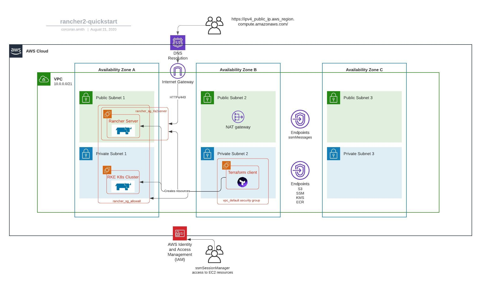

# AWS Rancher Quickstart

Two single-node RKE Kubernetes clusters will be created from two EC2 instances running Ubuntu 18.04 and Docker.

## Security Groups
Two security groups are created. One for "any/any" for both instances for open communication between Rancher Server and the RKE Quickstart host.

The second security group (rancher_sg_tls2server) allows you to restrict public TLS/HTTPs access to the Rancher server if it's running in a public subnet with a IPV4 DNS hostname (this is also set as the Rancher Server URL) as it's resolvable inside the VPC. Add public_ip addresses to the "external_access_cidr_blocks" variable accordingly.

## IAM Roles
A single IAM role has been created for both Rancher Server and RKE Quickstart instance [Rancher Docs](https://rancher.com/docs/rke/latest/en/config-options/cloud-providers/aws/)

The IAM role also has AWS managed role ec2roleforSSM for accessing the instances with ssmSessionManager

Both instances are also accessible over SSH using the SSH keys `id_rsa` and `id_rsa.pub` though only from within the VPC.

## EBS Encryption
The variables.tf file will need the default AWS account EBS encryption ID to default encrypt volumes on both Rancher Server and the Quickstart instance.

## Checkov Scanning
The .pre-commit-config.yaml runs Checkov for static code analysis scanning of AWS infra used in this repo.

## AWS Diagram

AWS High-level diagram: 

## Details

### Deployment

You *must* deploy this quickstart from within a VPC using a jumpbox/ssmSessionManager linux instance running Terraform and git. Because the Rancher provider and remote-exec require ports 22, 443, 6443; it's fair easier (and more secure) to then deploy from inside an existing VPC, unless you choose to add additional ports to the rancher_sg_tls2server security group. This, however, is not recommended.

<!-- BEGINNING OF PRE-COMMIT-TERRAFORM DOCS HOOK -->
## Requirements

| Name | Version |
|------|---------|
| terraform | >= 0.12 |
| aws | 3.1.0 |
| tls | 2.2.0 |

## Providers

| Name | Version |
|------|---------|
| aws | 3.1.0 |
| local | n/a |
| tls | 2.2.0 |

## Inputs

| Name | Description | Type | Default | Required |
|------|-------------|------|---------|:--------:|
| amivalues | Set values for ami filter | `list` | <pre>[   "ubuntu/images/hvm-ssd/ubuntu-bionic-18.04-amd64-server-*" ]</pre> | no |
| aws\_region | AWS region used for all resources | `string` | n/a | yes |
| cert\_manager\_version | Version of cert-mananger to install alongside Rancher (format: 0.0.0) | `string` | `"0.12.0"` | no |
| docker\_version | Docker version to install on nodes | `string` | `"19.03"` | no |
| ebs\_kms\_key\_id | AWS Account default EBS encryption key | `string` | n/a | yes |
| external\_access\_cidr\_blocks | IP addresses for external HTTPS access (if any) | `list` | <pre>[   "214.95.32.102/32",   "37.98.124.53/32" ]</pre> | no |
| iam\_profile\_name | n/a | `string` | `"rancher_iam_profile"` | no |
| instance\_type | Instance type used for all EC2 instances | `string` | `"t3a.medium"` | no |
| prefix | Prefix added to names of all resources | `string` | `"quickstart"` | no |
| rancher\_server\_admin\_password | Admin password to use for Rancher server bootstrap | `string` | n/a | yes |
| rancher\_version | Rancher server version (format: v0.0.0) | `string` | `"v2.4.5"` | no |
| rke\_kubernetes\_version | Kubernetes version to use for Rancher server RKE cluster | `string` | `"v1.18.3-rancher2-2"` | no |
| role\_name | The role name | `string` | `"rancher_iam_role"` | no |
| subnet\_id\_private | Subnet for aws\_quickstart\_rke\_cluster (if exists) | `string` | n/a | yes |
| subnet\_id\_public | Subnet for rancher\_server (if exists) | `string` | n/a | yes |
| vpc\_cidr\_block | VPC CIDR Block (assuming non-default) | `string` | n/a | yes |
| vpc\_id | VPC ID (assuming non-default) | `string` | n/a | yes |
| workload\_kubernetes\_version | Kubernetes version to use for managed workload cluster | `string` | `"v1.17.6-rancher2-2"` | no |

## Outputs

| Name | Description |
|------|-------------|
| rancher\_node\_ip | n/a |
| rancher\_server\_url | n/a |
| workload\_node\_ip | n/a |
<!-- END OF PRE-COMMIT-TERRAFORM DOCS HOOK -->
